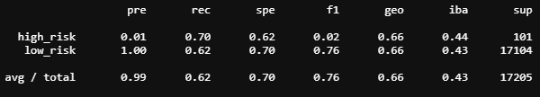
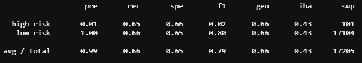
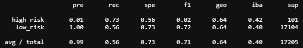

# CreditRisk_ML

## Recommendation

Below is a performance metric comparison between the (4) tested models. Based on the results my recommendation would be SMOTE oversampling due to the highest F1 and on par levels in the other categories. Note however that while this model scored teh best further refinement (or other models) should be pursued to improve the performance.

Accuracy
Accuracy is the ratio of correctly predicted observations compared to the total. The random oversampling, SMOTE oversampling and cluster centroids undersampling all have similar scores of .66. 

Precision
Precision tells us the confidence level in the accuracy of the classifications. All models have a very high average preceision of .99.

Recall
Tells us how well the model classifies. Undersampling via cluster centroid has the lowest value at .41 while SMOTE oversampling has the highest at .66.

F1
F1 is a combination metric of precision and recall. the best possible value is 1. Of the Models tested SMOTE oversampling had the highest F1 at .79

#### Naive Random Oversampling 
Balanced accuracy score 
.66

Classification Report 

#### SMOTE Oversampling 
Balanced accuracy score 
.658

Classification Report 

#### Undersample using cluster centroids algorithm 
Balanced accuracy score 
.658

Classification Report 

#### Combination (Over and Under) Sampling
<b>SMOTEENN algorithm</b>

Balanced accuracy score
.55

Classification Report 

