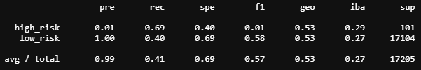

# CreditRisk_ML

#### Naive Random Oversampling 
<b>Performance overview</b> 

Balanced accuracy score 
.66

Classification Report

#### SMOTE Oversampling 
<b>Performance overview</b> 

Balanced accuracy score 
.658

Classification Report

#### Undersample using cluster centroids algorithm 
<b>Performance overview</b> 

Balanced accuracy score 
.658

Classification Report

#### Combination (Over and Under) Sampling
<b>SMOTEENN algorithm</b>

Balanced accuracy score
.55

Classification Report

#### Recommendation
